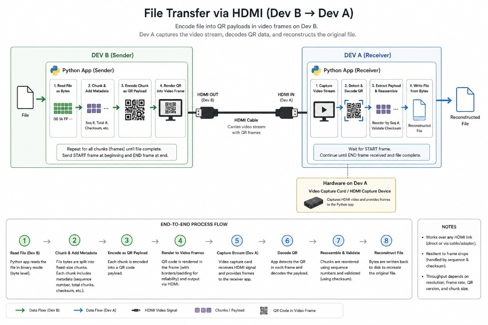

# QRV — File Transfer via HDMI

Transfer files between two machines over a standard HDMI link by encoding data as QR codes in a video stream. No network required — just a cable (or capture card) and Python.



## How It Works

**Dev B (Sender)** reads a file, splits it into chunks with metadata (sequence numbers, checksums), encodes each chunk as a QR code, and renders those codes into video frames output over HDMI.

**Dev A (Receiver)** captures the HDMI signal with a video capture card, decodes the QR codes from each frame, reassembles the chunks in order, validates integrity, and writes the reconstructed file to disk.

### End-to-End Flow

1. **Read file** (Dev B) — binary read at the byte level
2. **Chunk & add metadata** — fixed-size chunks with sequence number, total count, and checksum
3. **Encode as QR payload** — each chunk becomes a QR code
4. **Render to video frames** — QR centered on a neutral background, output via HDMI
5. **Capture stream** (Dev A) — capture card receives HDMI and provides frames
6. **Decode QR** — detect and decode payload from each frame
7. **Reassemble & validate** — reorder by sequence, verify checksums
8. **Reconstruct file** — write bytes back to disk

### Notes

- Works over any HDMI link — direct connection, cable, or adapter
- Resilient to frame drops via sequence numbers and checksums
- Throughput depends on resolution, frame rate, QR version, and chunk size

## Project Status

| Component | Status |
|-----------|--------|
| Sender (`encoder.py`) | Proof of concept |
| Receiver (`decoder.py`) | Proof of concept |

## Requirements

**Sender**

```bash
pip install pillow qrcode imageio imageio-ffmpeg
```

- [Pillow](https://pypi.org/project/Pillow/), [qrcode](https://pypi.org/project/qrcode/) — required
- [imageio](https://pypi.org/project/imageio/) + [imageio-ffmpeg](https://pypi.org/project/imageio-ffmpeg/) — optional (MP4 output)

**Receiver**

```bash
pip install zxing-cpp opencv-python-headless
```

## Usage (Sender)

Generate a PNG frame sequence or MP4 from a file:

```bash
# PNG frame sequence (for HDMI playback or further processing)
python encoder.py --in sample.bin --out ./out_frames --fps 30

# MP4 output (requires imageio-ffmpeg)
python encoder.py --in sample.bin --out transfer.mp4 --fps 30 --mp4
```

### Options

| Flag | Default | Description |
|------|---------|-------------|
| `--in` | *(required)* | Input file to transmit |
| `--out` | *(required)* | Output directory (PNG) or `.mp4` path |
| `--fps` | `30` | Frames per second |
| `--ecc` | `L` | QR error correction: `L`, `M`, `Q`, `H` |
| `--chunk` | `1800` | Payload bytes per frame |
| `--n` | `60` | Data frames per FEC block |
| `--k` | `12` | Parity frames per block (placeholder FEC) |
| `--qr-version` | `auto` | QR version `1`–`40` or `auto` |
| `--video` | `1920x1080` | Frame size, e.g. `1920x1080` |
| `--manifest-repeats` | `60` | Manifest frames at start |
| `--eof-repeats` | `90` | EOF frames at end |
| `--interleave` | off | Interleave blocks for burst-loss tolerance |
| `--mp4` | off | Write MP4 instead of PNG sequence |

### Example

```bash
python encoder.py --in sample.bin --out ./out_frames --fps 30 \
    --ecc L --chunk 1800 --qr-version auto --video 1920x1080
```

## Usage (Receiver)

Decode a PNG frame sequence captured from HDMI (or exported from an MP4):

```bash
python decoder.py --in ./qr_frames --out decoded.bin
```

### Options

| Flag | Default | Description |
|------|---------|-------------|
| `--in` | *(required)* | Directory containing `frame_*.png` files |
| `--out` | *(required)* | Output path for the reconstructed file |
| `-v`, `--verbose` | off | Print per-frame decode details |

### Round-trip example

```bash
# Dev B — encode
python encoder.py --in sample.bin --out ./qr_frames

# Dev A — decode (after capturing frames from HDMI)
python decoder.py --in ./qr_frames --out sample.bin
```

## Protocol (QRV1)

Each frame carries a versioned binary header (`QRV1`) with CRC-16, followed by payload and CRC-32:

| Frame type | Purpose |
|------------|---------|
| `MANIFEST` | File metadata (name, size, chunk size, FEC params) |
| `DATA` | File data chunk |
| `PARITY` | Forward error correction (placeholder; swap for RS/RaptorQ in production) |
| `EOF` | End-of-transfer marker |

Frames are rendered as large, centered QR codes on a gray background with a quiet zone for reliable capture.

## Hardware Setup

```
Dev B (Sender)                    Dev A (Receiver)
┌─────────────────┐               ┌─────────────────────────┐
│  Python sender  │               │  HDMI capture card      │
│  HDMI OUT       │─── HDMI ─────▶│  HDMI IN                │
│                 │               │  Python receiver        │
└─────────────────┘               └─────────────────────────┘
```

On the sender side, play the generated MP4 (or frame sequence) fullscreen over HDMI. On the receiver, connect a USB HDMI capture device, save captured frames as `frame_000000.png`, `frame_000001.png`, … and run `decoder.py` against that folder.